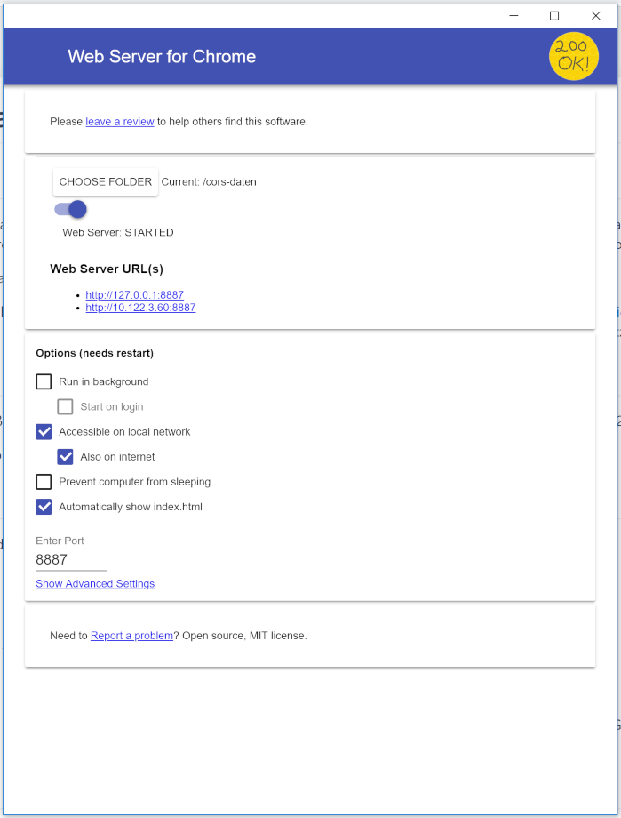
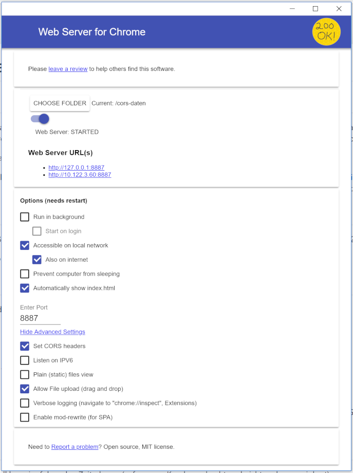

# Webserver for chrome

*Webserver for chrome* ist eine Erweiterung für den Chrome Webbrowser. Diese Erweiterung ermöglicht es lokale Dateien für die easydb5 als Web-URL freizugeben. 

## Installation

Rufen Sie den *Chrome App Store* auf und suchen Sie nach *Webserver for chrome*. Sie können auch den [Link](https://chrome.google.com/webstore/detail/web-server-for-chrome/ofhbbkphhbklhfoeikjpcbhemlocgigb/related) benutzen, um die Shopseite direkt zu öffnen. Anschließend klicken Sie auf **App installieren** und nach erfolgreicher Installation auf **App starten**.

Nach dem klicken auf *App starten*, dürfte sich nun folgendes Browser Fenster öffnen:

## Cors Konfiguration

Um ***CORS*** innerhalb von *Webserver for chrome* zu aktivieren, müssen Sie die *Advanced settings* aufklappen und hier den ersten Punkt 
***Set CORS headers*** aktivieren.

**Beachten Sie, dass nach dem verändern von Einstellungen der Webserver einen neustart benötigt, damit die Änderungen aktiv werden.**