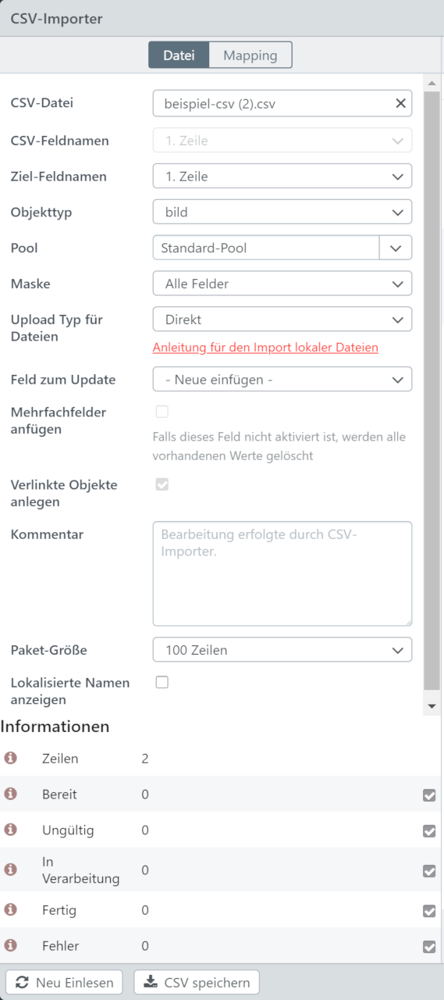
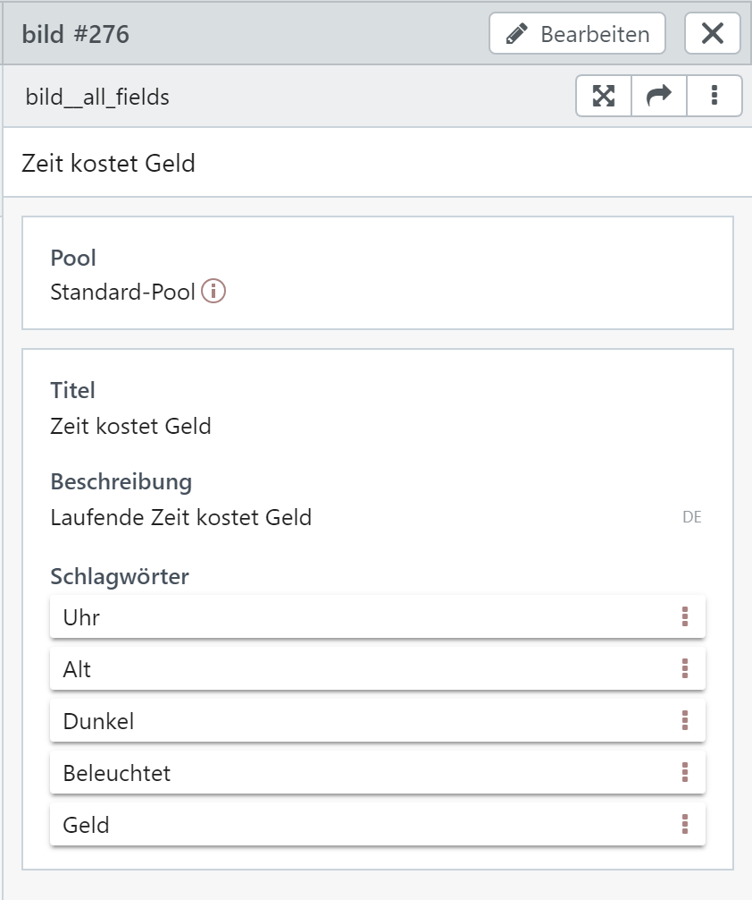
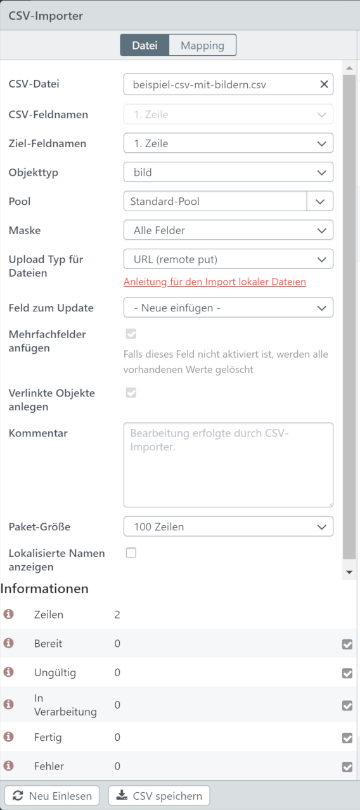
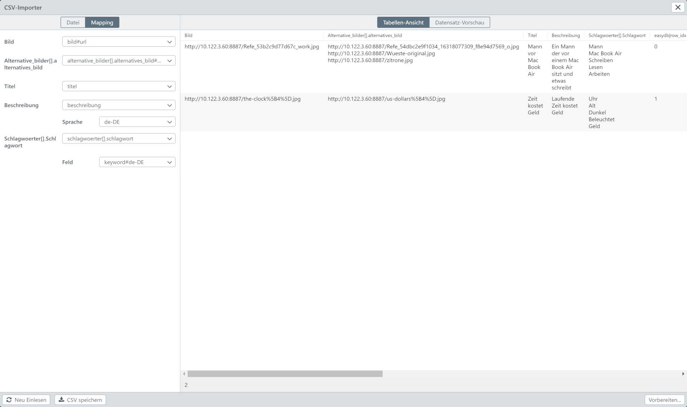

# How To CSV-Import

Um den Import von Objekten und den dazugehörigen Bildern mittels CSV durchführen zu können, benötigen Sie einen Webbrowser, welcher [CORS](/de/tutorials/cors) unterstützt. Beispielkonfigurationen für Webserver mit *CORS* können Sie [hier](/de/tutorials/cors) finden.

---

In den nachfolgenden Beispielen wird ein Objekttyp (bild) verwendet, welcher folgende Felder besitzt:

| Easydb Feld Name | Datentyp | Feldname | Ist Mehrfachfeld | Ist in Mehrfachfeld |
|------------------|----------|----------|------------------|---------------------|
| bild | Datei | Bild | Nein | Nein |
| alternative_bilder |  | Alternative Bilder | Ja | Nein |
| alternative_bilder.alternatives_bild | Datei | Alternatives Bild | Nein | Ja |
| titel | Einzeiliger Text | Titel | Nein | Nein |
| beschreibung | Mehrzeiliger Text (mehrsprachig) | Beschreibung | Nein | Nein |
| schlagwoerter | | Schlagwörter | Ja | Nein |
| schlagwoerter.schlagwort | schlagwort | Schlagwort | Nein | Ja |

## CSV Import (ohne Bild)

In diesem Beispiel werden wir ein neues Objekt mittels des CSV Importers innerhalb der easydb erstellen. 

Inhalt der CSV Datei:
```csv
Titel,Beschreibung,Schlagwoerter[].Schlagwort
Mann vor Mac Book Air,Ein Mann der vor einem Mac Book Air sitzt und etwas schreibt,"Mann
Mac Book Air
Schreiben
Lesen
Arbeiten"
Zeit kostet Geld,Laufende Zeit kostet Geld,"Uhr
Alt
Dunkel
Beleuchtet
Geld"
```
[CSV-Datei ohne Bilder](beispiel-csv.csv)

***CSV-Importer Datei Einstellungen:***



***CSV-Importer Mapping Einstellungen:***


***Ergebnis in easydb5:***



------

## CSV Import mit Bildern

In diesem Beispiel werden wir ein neues Objekt mit Bildern mittels des CSV Importers innerhalb der easydb erstellen. 

Inhalt der CSV Datei:
```csv
Bild,Alternative_bilder[].alternatives_bild,Titel,Beschreibung,Schlagwoerter[].Schlagwort
http://10.122.3.60:8887/Refe_53b2c9d77d67c_work.jpg,"http://10.122.3.60:8887/Refe_54dbc2e9f1034_16318077309_f8e94d7569_o.jpg
http://10.122.3.60:8887/Wueste-original.jpg
http://10.122.3.60:8887/zitrone.jpg",Mann vor Mac Book Air,Ein Mann der vor einem Mac Book Air sitzt und etwas schreibt,"Mann
Mac Book Air
Schreiben
Lesen
Arbeiten"
http://10.122.3.60:8887/the-clock%5B4%5D.jpg,http://10.122.3.60:8887/us-dollars%5B4%5D.jpg,Zeit kostet Geld,Laufende Zeit kostet Geld,"Uhr
Alt
Dunkel
Beleuchtet
Geld"
```
[Beispiel CSV und Bilder](beispiel-csv-mit-bildern.zip)


***CSV-Importer Datei Einstellungen:***



***CSV-Importer Mapping Einstellungen:***



Beachten Sie hier, dass Sie in der Auswahl den Eintrag mit ***#url*** auswählen.

***Ergebnis in easydb5:***

